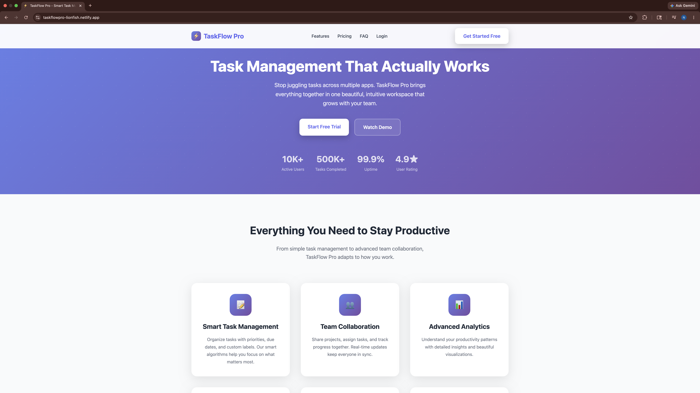

# TaskFlow Pro

We built TaskFlow Pro as a full product concept because we wanted to understand
what real SaaS business logic actually looks like in practice. Freemium limits
enforced server side. Stripe billing with webhook verification. A daily focus
algorithm that surfaces the three tasks that matter most right now. Free tier.
Pro plan at $9.99 a month. Built to run in production.

## Live Demo

https://taskflowpro-lionfish.netlify.app

The live demo shows the landing page and product design. The full experience,
authentication, task management, and Stripe billing, requires the local setup.
Follow the Getting Started instructions below.

## Screenshots



---

## What Makes This a Real Product

Most task app tutorials stop at CRUD. TaskFlow Pro goes further.

**Freemium enforcement is server side.** Limits are checked in the database
layer, not the frontend. The API returns `{ upgrade: true }` to drive upsell
without client-side trust. Free tier users cannot bypass limits from the client.

**Stripe webhooks use signature verification.** The `/webhook` route receives
the raw request body before `express.json()` runs. This is required for
Stripe's `constructEvent` to verify the payload. Pro upgrades happen server
to server, not through a client-controlled flag.

**The Daily Focus algorithm is a single SQL query.** It surfaces the top 3
tasks ordered by overdue first, then due today, then by priority. The user
sees what actually matters, not just what was added most recently.

**Streak tracking uses date arithmetic.** It checks whether yesterday's date
matches the last completion date before incrementing. This handles the edge
case where a user completes multiple tasks in one day without inflating the
count.

---

## Tech Stack

**Node.js + Express 5.** ESM modules throughout (`import`/`export`).

**PostgreSQL.** `pg` pool, schema auto-initialized on server start.

**express-session + bcryptjs.** Server side sessions, passwords hashed with
bcrypt at 10 salt rounds.

**Stripe.** Subscription checkout, webhook listener, customer ID stored per
user.

**HTML/CSS/JS.** No frontend framework. Six static pages served
from `/public`.

---

## Architecture

```
taskflowpro/
├── backend/
│   ├── server.js       — Express app, all API routes, Stripe integration
│   ├── database.js     — PostgreSQL pool, schema init, all query helpers
│   ├── package.json    — ESM module config, dependencies
│   └── .env.example    — environment variable template
└── public/
    ├── index.html      — marketing landing page
    ├── app.html        — authenticated task dashboard
    ├── login.html      — sign in
    ├── signup.html     — account creation
    ├── success.html    — post-payment confirmation
    └── cancel.html     — payment cancellation
```

---

## Database Schema

Three tables. Cascading deletes keep data clean when users or projects are removed.

```sql
users (
  id                SERIAL PRIMARY KEY,
  email             VARCHAR(255) UNIQUE NOT NULL,
  password_hash     VARCHAR(255) NOT NULL,
  is_pro            INTEGER DEFAULT 0,
  pro_activated_at  TIMESTAMPTZ,
  stripe_customer_id VARCHAR(255),
  streak_count      INTEGER DEFAULT 0,
  last_streak_date  DATE,
  last_login_at     TIMESTAMPTZ,
  created_at        TIMESTAMPTZ DEFAULT NOW()
)

projects (
  id          SERIAL PRIMARY KEY,
  user_id     INTEGER REFERENCES users(id) ON DELETE CASCADE,
  name        VARCHAR(255) NOT NULL,
  color       VARCHAR(50) DEFAULT '#6366f1',
  created_at  TIMESTAMPTZ DEFAULT NOW()
)

tasks (
  id           SERIAL PRIMARY KEY,
  user_id      INTEGER REFERENCES users(id) ON DELETE CASCADE,
  project_id   INTEGER REFERENCES projects(id) ON DELETE SET NULL,
  title        VARCHAR(500) NOT NULL,
  notes        TEXT DEFAULT '',
  priority     VARCHAR(20) DEFAULT 'medium',
  status       VARCHAR(20) DEFAULT 'active',
  due_date     DATE,
  completed_at TIMESTAMPTZ,
  created_at   TIMESTAMPTZ DEFAULT NOW()
)
```

---

## API Reference

Auth
```
POST /auth/signup          — create account, open session
POST /auth/login           — authenticate, open session
GET  /auth/logout          — destroy session, redirect to /
GET  /auth/me              — return current user (email, isPro, streakCount)
```

Projects
```
GET    /projects           — list all projects for session user
POST   /projects           — create project (enforces free tier limit)
DELETE /projects/:id       — delete project and cascade tasks
```

Tasks
```
GET    /tasks              — list tasks (optional ?projectId= filter)
GET    /tasks/focus        — top 3 tasks by overdue > due today > priority
GET    /tasks/stats        — completedToday, streakCount, totalActive
POST   /tasks              — create task (enforces free tier limit)
PUT    /tasks/:id          — update task; triggers streak update on completion
DELETE /tasks/:id          — delete task
```

Payments
```
POST /create-checkout-session  — create Stripe checkout, return redirect URL
POST /webhook                  — Stripe event listener; activates Pro on payment
```

---

## Getting Started

Prerequisites
- Node.js 18+
- PostgreSQL (local or remote)
- Stripe account with a product and price created

Local Setup

```bash
git clone https://github.com/Lionfish7777/taskflowpro.git
cd taskflowpro/backend
npm install
cp .env.example .env
```

Fill in `backend/.env`

```env
DATABASE_URL=postgresql://localhost/taskflowpro
SESSION_SECRET=your_session_secret_here
STRIPE_SECRET_KEY=sk_test_...
STRIPE_PRICE_ID=price_...
STRIPE_WEBHOOK_SECRET=whsec_...
PORT=4242
```

Start the server

```bash
npm start
# → http://localhost:4242
```

The database schema initializes automatically on first run.

Stripe Webhook for Local Testing

```bash
stripe listen --forward-to localhost:4242/webhook
```

Complete a test checkout and confirm the user's `is_pro` flag is set in the database.

---

## Freemium Model

| Feature | Free | Pro ($9.99/mo) |
|---|---|---|
| Projects | 3 | Unlimited |
| Tasks | 50 | Unlimited |
| Daily Focus | ✓ | ✓ |
| Streak Tracking | ✓ | ✓ |
| Advanced Features | — | ✓ |

Limits are enforced server side. The API returns `{ upgrade: true }` when a
limit is reached, which the client uses to surface the upgrade prompt.

---

## What We Learned

We did not know how Stripe worked before we built this. We did not know what
server side enforcement really meant at the database layer. We did not fully
understand why a SQL query is cleaner than forty lines of JavaScript sort logic.
We built this project to find out.

The webhook signature verification was the hardest lesson and the most valuable.
express.json() consumes the raw request body before the webhook handler ever sees
it. We found that out by failing. Earning the fix meant reading the documentation
until we understood why, not just what. That is the standard we try to hold now.

Server side enforcement taught us to think about trust the way professionals think
about it. Any user can open devtools and send whatever they want to your API. The
moment that became real to us we stopped asking where to put the limit and started
asking what can actually hold it. The database holds it. We are newer to this field
and we do not want to build things that fall apart under real conditions.

The streak logic and the daily focus algorithm taught us the same lesson from two
angles. Ask what breaks before you write a line. Let the database do what it is
built to do. We did not know those things deeply before this project. We know them
now. That is the only kind of learning we are interested in.

---

## Future Improvements

This is version one and we know exactly where it goes from here. We are not close to done.

- Email notifications for overdue and due today tasks. The algorithm already knows what matters. Getting that information to users without requiring them to open the app is the next step.
- OAuth sign in. Bcrypt is the right foundation. Google sign in is what users actually want and we want to give it to them.
- Team projects. The schema supports one user today. Shared projects and task assignment is where this becomes a real team tool.
- Mobile. A React Native wrapper would put the daily focus feature in someone's pocket on the way to work. That is where it belongs.
- Integration tests. We built the logic correctly. We want to prove it with tests that hit a real database, not mocks.

---

## Status

Public. Active development. Deployed to Netlify.
